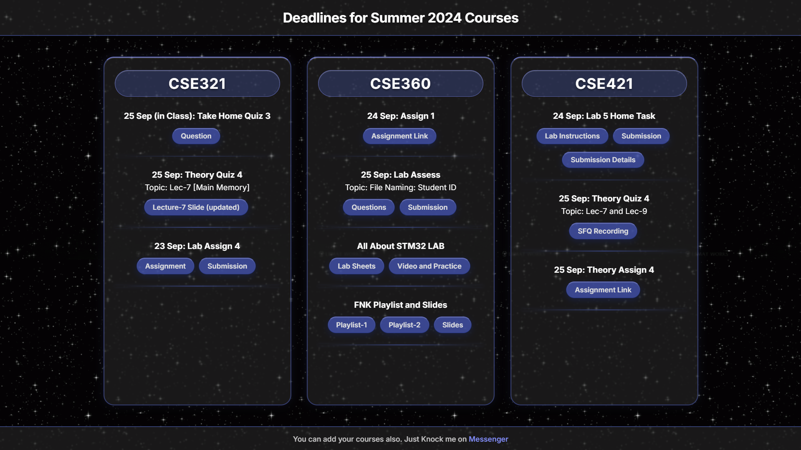

# Deadlines
A static web application to organize and keep track of course deadlines, assignments, lab tasks, and study resources for university courses (I made it for my own use. My friends also use it to stay updated).

## Overview
This repository contains a simple, dark-themed responsive website designed to track course deadlines, assignment links, slide materials, and submission forms.

## Website Preview

  

## Features
- **Course Cards Layout**: Organized view for each course with clear task titles and deadlines.
- **Direct Links**: Quick access buttons for assignment sheets, submission forms, lecture slides, and recordings.
- **Custom Styling**: Animated background, styled action buttons, and responsive grid layout.

## Live Preview
Visit the live website here: [Deadlines Web App](https://niloyahsan1.github.io/deadlines/)